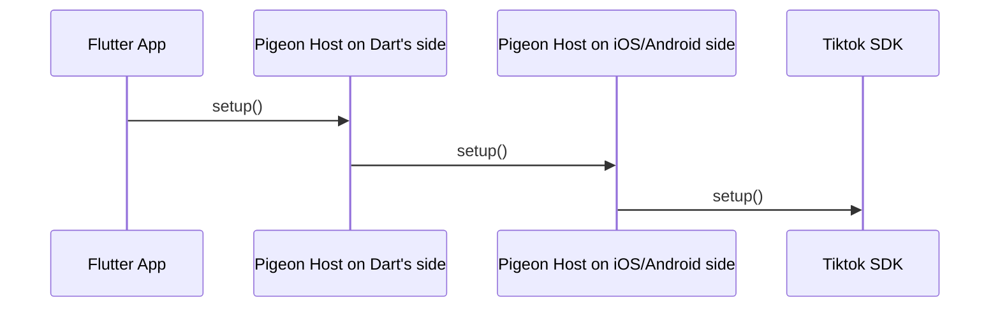
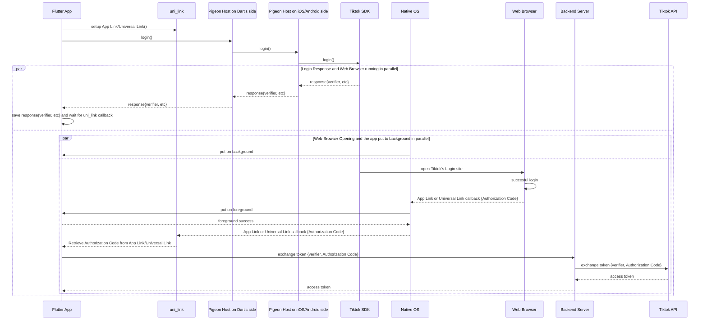

# tiktok_api

The `tiktok_api` project develops open-source Flutter plugin library to integrate with Tiktok's APIs. This project
provides the painless way to integrate with Tiktok since following Tiktok's documentation
and support, in our experience, will not work. 

This project is free but you can 

## Features
* (WIP) integration for Android
* (WIP) integration for iOS
* (planned) integration for web

## Requirements
* Flutter version 3.x.x
* Dart version 3.x.x
* A web server to store the App Link (Android) configuration file
* A web server to store the Universal Link (iOS) configuration file
* A backend server to exchange Tiktok's authorization code (after successful login) with Tiktok's access token

## Development Status
This project is still in development.

## Demo

## Getting Started
1. Create an app in [Tiktok's Developers site](https://developers.tiktok.com/apps/).
1. Add `Login Kit` product and configure `Login Kit` for Android. Also configure `Login Kit` for iOS. If you have redirect uri error you can try to add trailing slash on your Login Kit's Redirect URI like this one: `https://www.abc.com/login-callback/`.
1. Configure App Link for Android (you can use [Uni Links](https://pub.dev/packages/uni_links) package ) and test the App Link is working.
1. Configure Universal Link for iOS (you can use [Uni Links](https://pub.dev/packages/uni_links) package ) and test the Universal Link is working.
1. Configure your Tiktok app's scopes. You can start with `user.info.basic`
1. Submit your app and make sure the status is `Live in Production` 
1. Install this plugin package `flutter pub add tiktok_api`
1. Call the `setup()` method and pass your Tiktok's app client key: `_tiktokSDKApi.setup('<API_KEY>')`
1. Call the `login()` method and pass the scopes: `_tiktokSDKApi.login(['user.info.basi'], 'https://www.abc.com/login-callback/', browserAuthEnabled)`
1. Once the user authorized your Tiktok app, then Tiktok Login Kit will redirect back to your app using App Link (Android) or Universal Link (iOS). It is your job to handle the App Link or Universal Link redirection (step 3 above) and retrieve the authorization code. You have to exchange this authorization code with an access token. Once you get the access token you can use it to call all Tiktok's API. The exchange process must proceed in the backend. You can follow Tiktok's documentation to retrieve access token [here](https://developers.tiktok.com/doc/oauth-user-access-token-management).
1. You can see the `example` folder for the sample code on how to use this plugin library2023-12-01 18:10:46

## Code of Conduct
Please refer to our [Code of Conduct](CODE_OF_CONDUCT.md) document for guideline in the community.

## Developer Guidelines

### Sequence Diagram

There are two phases required. First, we have to do some setup to be able to communicate with the native side. Then we proceed with logging in to Tiktok and ask the user to authorize the scope of information that we requested. Once the user authorized then we have to exchange the authorization code with an access token. The access token will contains the impersonation credentials and the scopes. Once we got the access token we can use it to call all Tiktok APIs.

### Setup Phase

### Getting Access Token

